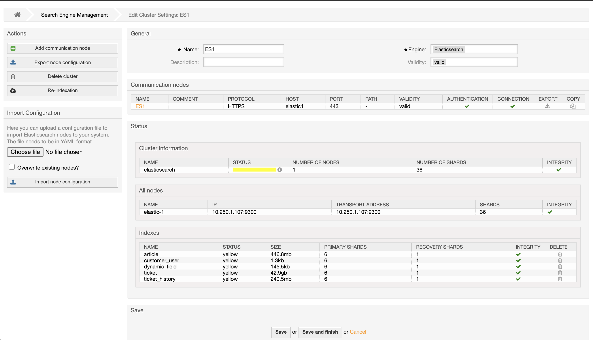

# Znuny-Search

## Basics

The API structure consists of different layers and is designed to be “maximally modular”.

The design goal: Enable easy connection to various search indexes.
As Software disappears, licenses change, and new software and trends appear, we would rather not get too dependent here. This wholistic approach is much more complex, but is a benefit eventually.
As a nice side effect, it makes it easier to test and analyze individual components.

The standard implementation includes the connection to the search and analysis engine: Elasticsearch.

However, as stated, is extensible at any time for use with other search engines.

Both Znuny versions 6.5 and 7 will support the new search API.

Releasing this feature as a package enables us to quickly extend, update, address issues and release the package without the need for a full framework update.


## Connect to a cluster in Znuny

1. Go into new "Search Engine" Administrator view, then add new cluster.
2. Create new communication node with server properties. If authentications is enabled, select "Authentification" checkbox and fill in login and password.
If connection test passed, save node.
3. (Optional) Select which indexes you want to include in your system. By default these are registered in system configuration option: "SearchEngine::Loader::Index*ActiveEngine*".
4. Go into reindexation view of the newly created cluster, select all indexes to reindex and execute this operation.\
Note: Reindexing might take a while. We start with the "latest" ticket data, so that you
can searching for the most recent information, while the reindexation is running.

5. Live indexing is queue based. The queue is checked every minute by default. After this time it should be visible to the search.




If everything is setup correctly you can start to use the Search API, for example using
the Znuny-SearchFrontend or by creating Dashboards in Grafana.


### CustomerUser configuration

Usage of CustomerUser backend can be set by changing configuration of
your CustomerUser Backend, most likely in your Config.pm.


- Modify your configuration for **DB** backend\
  `$Self->{CustomerUser}, $Self->{CustomerUser1}, etc`. in a way that it
will have a high priority.
- Change the "Module" from `Kernel::System::CustomerUser::DB` to `Kernel::System::CustomerUser::Elasticsearch`
- Add "CustomerUserEmailTypeFields" as a list of fields that are supposed to be an emails, example:\
    ```
    ..
    CustomerUserEmailTypeFields => {
        'email' => 1,
    },
    ..
    ```

Elasticsearch should work for CustomerSearch API calls in the system.
If it's not enabled/connected it will fallback to DB module.

Standard Search API (Kernel::System::Search->Search(..)) for CustomerUser also needs this configuration.

### CustomerUser configuration - syn external DB sources
If external DB sources are used and therefore the CustomerUser management is not done in Znuny,
it is possible to synchronize thos external data with a daemon task: `Daemon::SchedulerCronTaskManager::Task###CustomEngineSynchronizeData`\
which is disabled by default.


## Znuny-Search settings

### Admin system configuration (Overview)

- "SearchEngine###Enabled", enable Search engines functionality,
- "SearchEngine::Loader::Engine", register Search engines,
- "SearchEngine::Loader::Index::ES", register indexes for Elasticsearch engine,
- "..EventModulePost..ObjectIndex", all event listeners for default indexes,
- "SearchEngine::Loader::Fields::Ticket", extension config to define new Fields into the index,
- "Daemon::SchedulerCronTaskManager::Task###SearchEngineReindex", cron task which re-indexes data at specified time when there is a mismatch between sql and elasticsearch object count,
- "Daemon::SchedulerCronTaskManager::Task###ES-IndexQueueDataProcess", cron task that checks (by default every 1 minute) cached queue of data to index,
- "Daemon::SchedulerCronTaskManager::Task###CustomEngineSynchronizeData", cron task that synchronizes "CustomerUser" index data with SQL data (turned off by default),
- "SearchEngine::IndexationQueue###Settings", contains any settings for cached indexation queue,
- "SearchEngine::Reindexation###Settings", contains any settings for reindexation,
- "SearchEngine::Loader::Index::ES::Plugins###000-Framework", registers "Ingest" plugin for Elasticsearch,
- "SearchEngine::ES::TicketSearchFields###Fulltext", list of ticket properties that fulltext search will use. Ticket, article, attachment and dynamic fields columns can be used as a fields,

### Adding a custom index

1. Register new index in system configuration option: "SearchEngine::Loader::Index::*ActiveEngine*".
The key represents index name that will be used by the API on the higher level of abstraction, value represents the raw index name.
2. If live-indexing is needed, add EventModulePost event listener similar to existing ones.
3. Create new modules:

    \- Kernel/System/Search/Object/Query/*IndexName*.pm

    \- Kernel/System/Search/Object/Default/*IndexName*.pm

As a pattern use e.g. the TicketHistory module.


### API Documentation

The Search API has no special documentaion. We use Perl-Doc and recommend you have
a look at the Search.pm .
All you need to know, related to "how to use the new Search API" can be found
in the Perldoc for `sub Search()` .

You will find all parameter and small examples like this:
```Perl
    # simple call for all of single ticket history
    my $Search = $SearchObject->Search(
        Objects => ["TicketHistory"],
        QueryParams => {
            TicketID => 2,
        },
    );

    # more complex call
    my $Search = $SearchObject->Search(
        Objects => ["Ticket", "TicketHistory"],
        QueryParams => {
            TicketID => [1,2,3],
            SLAID => {
                Operator => 'IS NOT EMPTY'
            },
            TicketHistoryID => {
                Operator => '>=', Value => 1000,
            },
        },
        ResultType => "ARRAY",
        SortBy => ['TicketID', 'TicketHistoryID'],
        OrderBy => ['Down', 'Up'],
        Limit => ['', 10],
        Fields => [["Ticket_TicketID", "Ticket_SLAID"],["TicketHistory_TicketHistoryID", "TicketHistory_Name"]],
    );
```

#### Rules

1. Index will work only if there is a representation of its SQL table.
2. If first point is not met, custom support can be done using new module for functions, that is: Kernel/System/Search/Object/Engine/*ActiveEngine*/*IndexName*.pm


## Usefull commands for debbuging ElasticSearch:

Retrieve information about actual health of cluster (important when operating on multiple shards).

`GET _cluster/health`

Retrieve information about size of index (sum of memory of all shard/nodes), specify health of each index (makes debugging easier).

`GET _cat/indices`

Retrieve information about each node (their shards (p - primary/r - replicas)) and many other important tabs.

`GET _cat/shards`